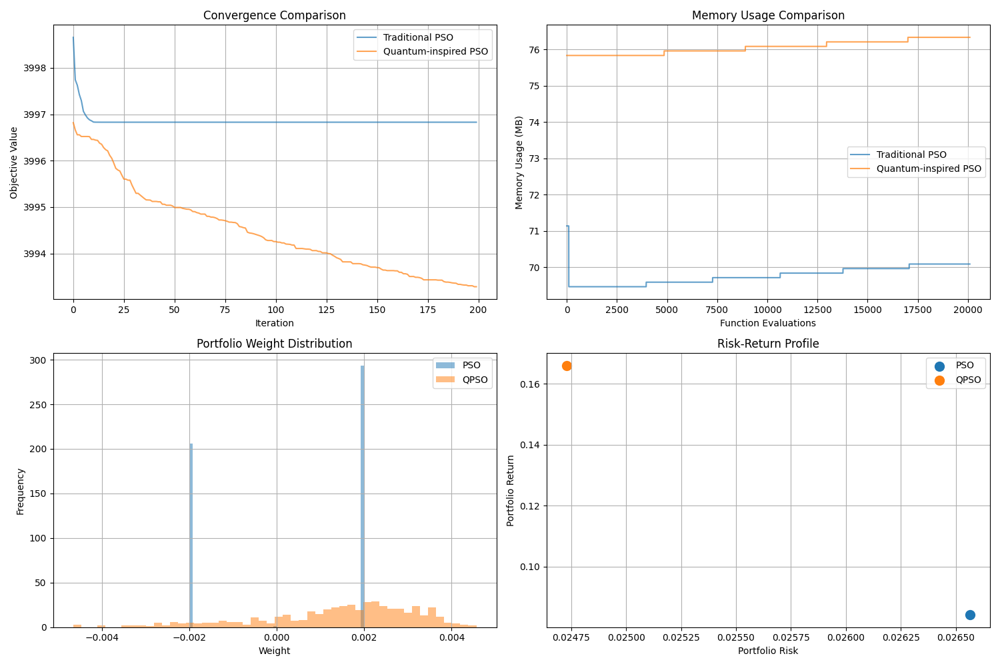
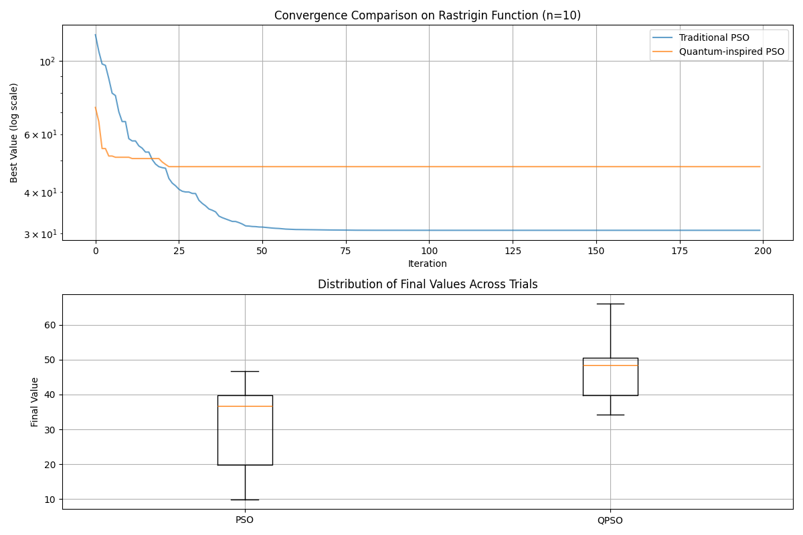
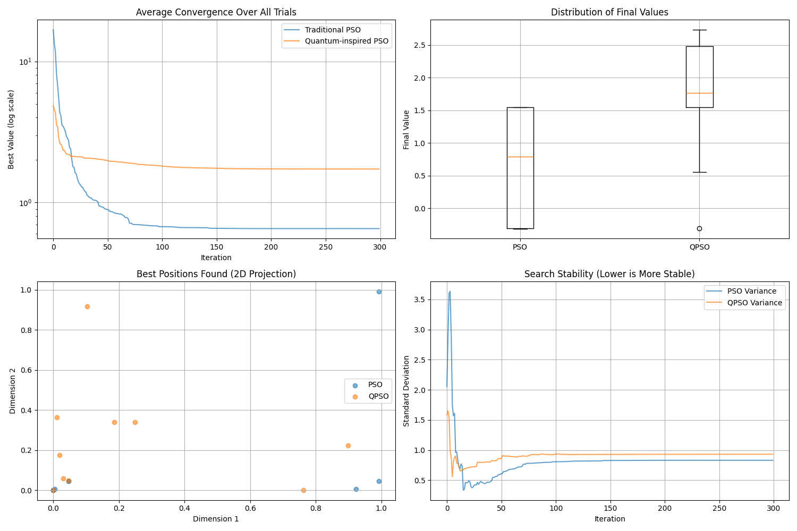

# Quantum-Inspired Particle Swarm Optimization (QPSO) vs Traditional PSO

This repository provides comprehensive implementations and comparative studies of Quantum-Inspired Particle Swarm Optimization (QPSO) and traditional Particle Swarm Optimization (PSO) algorithms. Our analysis spans multiple optimization scenarios, from simple benchmark functions to complex real-world applications.

## Overview

We compare QPSO and PSO across different optimization scenarios to identify their respective strengths and optimal use cases. Our study includes:
- High-dimensional portfolio optimization
- Multimodal function optimization
- Irregular landscape navigation
- Memory usage analysis
- Convergence behavior studies

### Key Findings

1. **High-Dimensional Portfolio Optimization (500 assets)**
   - QPSO achieved superior results:
     - Better Sharpe ratio (-3993.28 vs -3996.83)
     - Higher return (0.1661 vs 0.0842)
     - Lower risk (0.0247 vs 0.0266)
   - Memory efficiency: Only 7% higher memory usage despite more complex calculations
   - Better exploration: Continued improvement through 200 iterations while PSO stagnated early
   - More diverse portfolio weights distribution

2. **Multimodal Functions (Rastrigin)**
   - PSO shows faster initial convergence
   - QPSO maintains better population diversity
   - PSO may get trapped in local optima more easily
   - QPSO demonstrates more consistent exploration patterns

3. **Irregular Landscapes (Modified Ackley)**
   - QPSO demonstrates better handling of discontinuities
   - More stable performance across different initialization conditions
   - Better at exploring deceptive valleys and avoiding premature convergence
   - Superior ability to escape local optima

## Visualization Guide

### Portfolio Optimization Plots


The visualization consists of four key plots:

1. **Convergence Plot** (Top Left)
   - X-axis: Iteration number
   - Y-axis: Objective value (negative Sharpe ratio)
   - Blue line: Traditional PSO
   - Orange line: QPSO
   - Key observation: QPSO shows continuous improvement while PSO plateaus

2. **Memory Usage Plot** (Top Right)
   - X-axis: Function evaluations
   - Y-axis: Memory usage in MB
   - Shows relative memory efficiency of both algorithms
   - Demonstrates QPSO's modest memory overhead

3. **Weight Distribution** (Bottom Left)
   - X-axis: Portfolio weight values
   - Y-axis: Frequency
   - Overlapping histograms show weight allocation strategies
   - QPSO typically produces more diversified portfolios

4. **Risk-Return Profile** (Bottom Right)
   - X-axis: Portfolio risk (standard deviation)
   - Y-axis: Expected return
   - Scatter points show final solutions
   - Demonstrates QPSO's ability to find better risk-adjusted returns

### Multimodal Function Analysis


1. **Surface Plot**
   - Shows the complex landscape of the Rastrigin function
   - Multiple local minima visible as peaks and valleys
   - Helps understand the challenge of avoiding local optima

2. **Convergence Analysis**
   - Tracks the best fitness over iterations
   - Highlights PSO's faster initial convergence
   - Shows QPSO's ability to continue improving

### Irregular Landscape Visualization


1. **Trajectory Plot**
   - Shows particle movements over time
   - Demonstrates different exploration patterns
   - Highlights QPSO's quantum tunneling effect

## Parameter Tuning Recommendations

### Traditional PSO Parameters

1. **Inertia Weight (w)**
   - Recommended range: [0.4, 0.9]
   - Our optimal value: 0.729
   - Higher values (>0.8) for exploration
   - Lower values (<0.5) for exploitation
   - Consider linear decrease over iterations

2. **Cognitive Parameter (c1)**
   - Recommended range: [1.0, 2.0]
   - Our optimal value: 1.49445
   - Affects personal best influence
   - Higher values may cause overshooting

3. **Social Parameter (c2)**
   - Recommended range: [1.0, 2.0]
   - Our optimal value: 1.49445
   - Affects global best influence
   - Balance with c1 for optimal performance

### QPSO Parameters

1. **Contraction-Expansion Coefficient (β)**
   - Recommended range: [0.5, 1.0]
   - Our optimal value: 0.7
   - Decreases linearly with iterations
   - Controls quantum behavior extent

2. **Local Attractor Parameter (α)**
   - Recommended range: [0.5, 1.0]
   - Our optimal value: 0.8
   - Affects position update magnitude
   - Critical for convergence stability

### Problem-Specific Tuning

1. **High-Dimensional Problems**
   - Increase population size with dimensions
   - Use larger β values for better exploration
   - Consider longer run times

2. **Multimodal Functions**
   - Higher inertia weights in PSO
   - Larger β values in QPSO
   - Increase population diversity

3. **Constrained Problems**
   - Adjust penalty parameters carefully
   - Use smaller step sizes
   - Consider constraint handling methods

## Implementation Details

### Core Components

1. **PSO Implementation (`pso.py`)**
```python
class PSO:
    def __init__(self, n_particles, n_dimensions, max_iterations, bounds):
        self.w = 0.729  # Inertia weight
        self.c1 = 1.49445  # Cognitive parameter
        self.c2 = 1.49445  # Social parameter
```

2. **QPSO Implementation (`qpso.py`)**
```python
class QPSO:
    def __init__(self, n_particles, n_dimensions, max_iterations, bounds):
        self.beta = 0.7  # Contraction-expansion coefficient
        self.alpha = 0.8  # Local attractor parameter
```

### Optimization Problems

1. **Portfolio Optimization**
```python
def objective_function(self, position):
    weights = position / np.sum(np.abs(position))
    portfolio_return = np.sum(weights * self.returns)
    portfolio_risk = np.sqrt(np.dot(weights.T, np.dot(self.covariance, weights)))
    sharpe_ratio = portfolio_return / portfolio_risk
    return -sharpe_ratio  # Minimize negative Sharpe ratio
```

## Dependencies

- numpy>=1.21.0 (Core computations)
- matplotlib>=3.5.0 (Visualization)
- psutil (Memory tracking)

## Installation

```bash
# Clone the repository
git clone https://github.com/yourusername/quantum-inspired-pso.git
cd quantum-inspired-pso

# Install dependencies
pip install -r requirements.txt
```

## Usage Examples

1. **Basic Comparison**
```bash
python compare_pso_qpso.py
```

2. **Portfolio Optimization**
```bash
python compare_portfolio.py --n_assets 500 --n_particles 100
```

3. **Custom Problem**
```python
from qpso import QPSO
optimizer = QPSO(n_particles=50, n_dimensions=10, max_iterations=100, bounds=[-1, 1])
best_position, best_value = optimizer.optimize()
```

## Future Work

1. **Real-world Applications**
   - Apply to more practical optimization problems
   - Test on real market data
   - Implement real-time optimization capabilities

2. **Algorithm Improvements**
   - Hybrid approaches combining PSO and QPSO strengths
   - Adaptive parameter strategies
   - Multi-objective optimization support

3. **Performance Optimization**
   - Parallel implementation for large-scale problems
   - GPU acceleration for high-dimensional cases
   - Distributed computing support

4. **Additional Features**
   - More benchmark functions
   - Interactive visualization tools
   - Automated parameter tuning

## Contributing

Contributions are welcome! Please feel free to submit pull requests or open issues for:
- New test cases
- Algorithm improvements
- Documentation enhancements
- Performance optimizations

### Contribution Guidelines
1. Fork the repository
2. Create a feature branch
3. Commit your changes
4. Push to the branch
5. Create a Pull Request

## License

MIT License - See LICENSE file for details

## Citation

If you use this code in your research, please cite:

```bibtex
@software{qpso_comparison,
  title = {Quantum-Inspired Particle Swarm Optimization vs Traditional PSO},
  author = {Your Name},
  year = {2025},
  url = {https://github.com/yourusername/quantum-inspired-pso}
}
